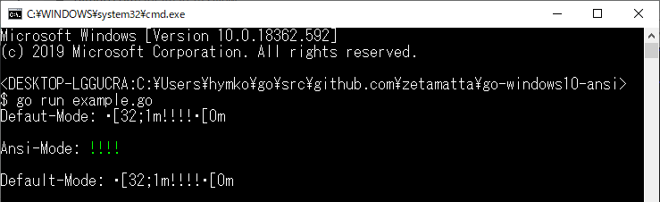

go-windows1x-virtualterminal
=============================

This package enables following features on Windows10 and Windows11:

- Enabling ANSI Escape Sequences for stdout and stderr
- Enabling the input of keyboard arrow keys in the form of codes such as `ESC[A` to `ESC[D.` from stdin

If the platform is not Windows, the original terminal often supports escape sequences, so each function exits silently without causing an error.

If the platform is Windows older than version 10, each function will return `virtualterminal.ErrNotSupported` because the command prompt does not support these features.

Enabling ANSI Escape Sequences
------------------------------

```examples/example.go
package main

import (
    "errors"
    "fmt"
    "os"

    "github.com/hymkor/go-windows1x-virtualterminal"
)

func mains() error {
    fmt.Println("Defaut-Mode: \x1B[32;1m!!!!\x1B[0m\n")
    closer, err := virtualterminal.EnableStdout()
    if err != nil {
        if errors.Is(err, virtualterminal.ErrNotSupported) {
            return fmt.Errorf("This machine can not use ANSI-ESCAPE-SEQUENCE: %w", err)
        }
        return err
    }
    fmt.Println("Ansi-Mode: \x1B[32;1m!!!!\x1B[0m\n")
    closer()
    fmt.Println("Default-Mode: \x1B[32;1m!!!!\x1B[0m\n")
    return nil
}

func main() {
    if err := mains(); err != nil {
        fmt.Fprintln(os.Stderr, err.Error())
        os.Exit(1)
    }
}
```



Read a key without Enter-key
---------------------------

```keyin/example.go
package main

import (
    "fmt"
    "os"
    "strings"

    "github.com/hymkor/go-windows1x-virtualterminal"
    "github.com/hymkor/go-windows1x-virtualterminal/keyin"
)

func mains() error {
    // EnableStdin should be called once in one application.
    close1, err := virtualterminal.EnableStdin()
    if err != nil {
        return err
    }
    defer close1()

    // Raw switches the terminal to raw-mode.
    // It should be called once in one readline loop.
    close2, err := keyin.Raw()
    if err != nil {
        return err
    }
    defer close2()

    fmt.Print("Hit any key: ")

    ch, err := keyin.Get()
    if err != nil {
        return err
    }

    ch = strings.ReplaceAll(ch, "\x1B", "<ESC>")
    fmt.Println(ch)
    return nil
}

func main() {
    if err := mains(); err != nil {
        fmt.Fprintln(os.Stderr, err.Error())
        os.Exit(1)
    }
}
```

Enabling the input of keyboard arrow keys
------------------------------------------

```examples/example2.go
package main

import (
    "fmt"
    "io"
    "os"

    "golang.org/x/term"

    "github.com/hymkor/go-windows1x-virtualterminal"
)

func readLine() (string, error) {
    oldState, err := term.MakeRaw(int(os.Stdin.Fd()))
    if err != nil {
        return "", err
    }
    defer term.Restore(int(os.Stdin.Fd()), oldState)

    disableIn, err := virtualterminal.EnableStdin()
    if err != nil {
        return "", err
    }
    defer disableIn()

    disableOut, err := virtualterminal.EnableStdout()
    if err != nil {
        return "", err
    }
    defer disableOut()

    terminal := term.NewTerminal(&struct {
        io.Reader
        io.Writer
    }{os.Stdin, os.Stdout}, "> ")

    return terminal.ReadLine()
}

func main() {
    line, err := readLine()
    if err != nil {
        fmt.Fprintln(os.Stderr, err.Error())
        os.Exit(1)
    }
    fmt.Println("Line:", line)
}
```
